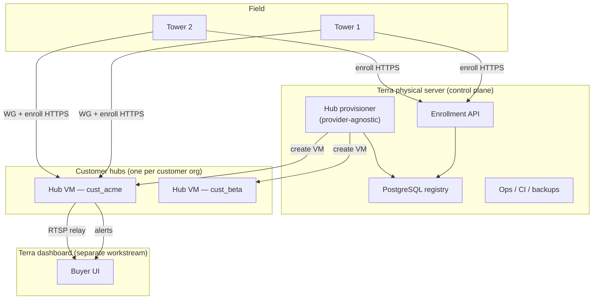

# Considering Physical Server for VPS

**Terra Industries · Internal Architecture · June 2026**

This document records how Terra’s **self-hosted physical server** fits into the Kallon mass-deployment architecture, how it relates to per-customer hub VPS provisioning, registry placement, and vendor lock-in. It complements `kallon_mass_deployment_roadmap.md`.

---

## Where the physical server fits

Think of it as **Terra’s control plane** — not the video path, and not necessarily every customer VPN hub.



| Role | On physical server? | Why |
|------|---------------------|-----|
| **Postgres registry** | **Yes — from day 1** | Single source of truth; no interim SQLite/Sheet migration |
| **Enrollment API** | **Yes** | Towers call this on first boot; stable HTTPS endpoint |
| **Hub provisioner** | **Yes** (orchestrator) | Decides *where* hub VMs live; calls provider adapters |
| **Per-customer hub VMs** | **No** (by default) | Hubs run on external VPS (Option B) or customer/on-prem host (Option C) |
| **Terra dashboard backend** | Often same machine early | Reads registry + alert stream |
| **RTSP/video relay** | Usually on **hub**, not control plane | Keeps control plane light |

**Core principle:** towers talk to **hub** (VPN + alerts) and **enrollment API** (config). They never talk to Postgres directly. The physical server is the **brain**; hubs are **edge rendezvous points** per customer org.

---

## Can the physical server provision a VPS per customer?

**Yes — as the orchestrator**, not as “the VPS itself.”

Three modular hub hosting options share the same installer, `wg0.conf`, enrollment flow, and `gateway_manifest.json`:

| Option | How | AWS required? | Status |
|--------|-----|---------------|--------|
| **A. VMs on physical server** | Proxmox / KVM / LXD: one VM per `cust_*` | No | Available; not default |
| **B. External VPS via API** | Hetzner, OVH, DigitalOcean, Vultr, Linode, etc. | **No** | **Default for retail** |
| **C. Manual / customer DC** | `kallon-gateway-init.sh` on any Ubuntu host | No | **Enterprise / sovereign tier** |

The physical server runs a **hub provisioner** with a `HubProvider` interface:

```bash
kallon-hub-provision cust_acme --provider hetzner    # Option B (default)
kallon-hub-provision cust_acme --provider manual --host 203.0.113.42  # Option C
kallon-hub-provision cust_acme --provider proxmox    # Option A (lab / fallback)
```

All paths produce the same **`gateway_manifest.json`** and registry row. **No AWS required.**

---

## Postgres on the physical server from day 1

| Decision | Rationale |
|----------|-----------|
| Postgres is the **only** registry store from implementation start | Schema + migrations in repo; enrollment API and factory CLI share one DB |
| SQLite / Google Sheets | Not used as source of truth |
| `RegistryProvider` interface | Retained for tests; production = `KALLON_REGISTRY=postgres` |

**Exposure:**

- Postgres: **not** on public internet — LAN or ops VPN only.
- Enrollment API: **HTTPS** public (reverse proxy + TLS on physical server).
- Connection string via environment — never committed to git.

**Suggested layout on the physical server:**

```text
Terra physical server
├── PostgreSQL 16           ← registry (customers, towers, ip_alloc, audit)
├── enrollment-api          ← FastAPI, TLS via Caddy/nginx
├── hub-provisioner         ← HubProvider adapters (hetzner, manual, …)
├── (optional) dashboard API / alert ingest
└── backups: pg_dump + registry export
```

Customer hub VMs (Option B) are small Ubuntu instances elsewhere (1 vCPU, 1 GB RAM is enough for WG + alert listener at pilot scale). Towers reach them over LTE via outbound UDP 51820.

---

## Vendor lock-in audit

| Piece | Lock-in risk | Mitigation |
|-------|--------------|------------|
| **WireGuard** | Low | Open protocol; `wg0.conf` portable anywhere |
| **RTSP + mediamtx** | Low | Standard RTSP |
| **Alert JSON + HMAC** | None | Terra-owned contract; dashboard implements verifier |
| **Jetson / L4T** | Medium | NVIDIA stack — acceptable for this product |
| **ONVIF cameras** | Low | Brand-agnostic by design |
| **PostgreSQL** | None | Run anywhere |
| **Terraform + AWS** | High if required | **Not in core** — optional adapter only; not default |
| **Lightsail (current lab)** | Low | Lab stand-in; replace with Option B or C hub |
| **Enrollment API** | None | Terra-owned; runs on any Linux |
| **VPS provider (Hetzner, etc.)** | Low | `HubProvider` interface; swap provider without changing tower or enrollment contract |
| **Terra dashboard** | Product coupling | Integrates via RTSP + webhook contract only |

**What makes the architecture strong** — fixed contracts, not a cloud vendor:

1. `device.env` + identity formats (`cust_*`, `kln_*`, `clm_*`)
2. Enrollment API request/response (tower ↔ platform)
3. `gateway_manifest.json` (hub metadata)
4. WireGuard peer model (hub `/32` per tower)
5. RTSP outlet + HMAC alert outlet (dashboard plug-in)
6. Modular Jetson installer (`00`–`99`)

Everything else is a **replaceable adapter**.

---

## Terraform and AWS — clarified

Terraform was an **example** of automating hub creation without a console. It is **not** a requirement.

| Approach | Vendor lock-in | Solo-friendly |
|----------|----------------|---------------|
| Shell + provider HTTP API (Hetzner, OVH, DO, …) | Low | **Yes — default** |
| Ansible | Low | Yes |
| Proxmox API (Option A) | None (your metal) | Yes — lab fallback |
| Manual `kallon-gateway-init.sh` (Option C) | None | First enterprise customers |
| Terraform + AWS | Tied to TF + AWS | **Not default** |

**Default path:** `kallon-hub-provision` + `HubProvider` interface; first adapter = **Hetzner or OVH** (or chosen API VPS); second adapter = **manual** (Option C).

---

## How this updates the product model

| Prior assumption | With physical server + Option B/C |
|------------------|-----------------------------------|
| Registry on SQLite then Postgres | **Postgres on physical server from day 1** |
| Terra CI / Terraform creates hub | **Hub provisioner on physical server** calls VPS API or manual init |
| Dedicated hub per customer org | **Unchanged** — VM at any provider or customer host |
| Buyer uses dashboard only | **Unchanged** |
| AWS required | **No** — any VPS with UDP 51820 or on-prem Ubuntu |

Buyer never opens a terminal. Terra engineers never open AWS console per tower or per customer — hub creation is one scripted `kallon-hub-provision` call per new `cust_*`.

---

## Practical next steps

1. Stand up **Postgres + enrollment API** on the physical server.
2. Implement **`HubProvider`** with **`hetzner`** (or chosen API) as default and **`manual`** for Option C.
3. Implement **`kallon-gateway-init.sh`** + **`kallon-gateway-add-peer.sh`** — run inside each hub VM; provider-agnostic.
4. Point lab Jetson at enrollment API on physical server; retire hand-edited `wg-keys.txt` flow.
5. Dashboard integrates only **RTSP + alert webhook** — no dependency on VPS provider.

---

## One-line summary

**Terra’s physical server is the control plane (Postgres + enrollment + hub automation); each customer gets a dedicated hub VM via API VPS (Option B) or manual/on-prem init (Option C); the core is WireGuard + RTSP + signed alerts — no AWS, no Terraform, no buyer terminals.**

---

*Terra Industries · Considering Physical Server for VPS · June 2026*
