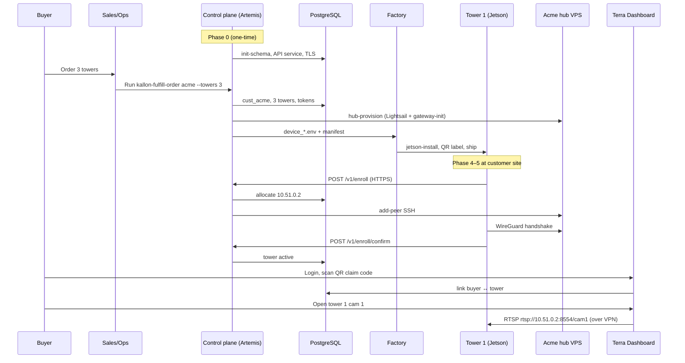

# Order to live feed — end-to-end walkthrough

**Terra Industries · Internal Engineering**

This document traces one retail scenario: **Acme Security orders three Sentry
Towers**, installs them on site, and **a buyer watches camera 1 on tower 1** in
the Terra dashboard.

It names **who** (role or system), **what** (action or software), and **where**
(machine or network) for every step.

| Related docs | Role |
|--------------|------|
| `docs/postgres-windows-server-setup.md` | One-time control plane (Path P) |
| `docs/order-fulfillment.md` | `kallon-fulfill-order` reference |
| `docs/field-test-setup.md` | Bench validation (Jetson §5) |
| `docs/alert-webhook.md` | Dashboard integration contract (RTSP + HMAC) |
| `docs/customer-gateway.md` | Hub provisioning internals |

---

## Scenario

| Item | Value |
|------|-------|
| Customer | Acme Security (`cust_acme`, slug `acme`) |
| Order | 3 towers, 2 cameras each |
| Hub | New AWS Lightsail VPS (`--provider lightsail`) |
| VPN subnet | Auto-assigned `/24` (e.g. `10.51.0.0/24` if `10.50` is `cust_lab`) |
| Tower VPN IPs | Allocated at enroll: e.g. `10.51.0.2`, `10.51.0.3`, `10.51.0.4` |
| Hub VPN IP | `10.51.0.1` |
| Enrollment URL | `https://enroll.yourdomain.com/v1` (operator-chosen domain) |

---

## Actors

| Actor | Who | Never does |
|-------|-----|------------|
| **Buyer** | Acme security manager / end user | SSH, registry CLI, hub console, `device.env` editing |
| **Sales / ops** | Terra staff taking the order | Tower firmware, WireGuard peer edits |
| **Control plane** | Postgres + enrollment API on **Artemis** (Windows Server) | Camera video relay (only registry + enroll + peer-add) |
| **Factory** | Terra bench tech preparing Jetsons | Customer site install (unless field services) |
| **Installer** | Acme or Terra field crew at site | Registry, hub provisioning |
| **Tower** | Jetson on pole/enclosure | Manual enrollment after factory prep |
| **Customer hub** | One Ubuntu VPS per org (Lightsail) | Buyer login UI |
| **Dashboard** | Separate Terra product (buyer UI) | Provisioning (reads VPN + registry contract) |

---

## Phase 0 — One-time platform (before any orders)

Done once on **Artemis** (`C:\Users\Artemis\Documents\kallon-sentry`). No buyer
involvement.

| Step | Who | What | Where |
|------|-----|------|-------|
| 0.1 | Terra ops | Install PostgreSQL 16, create `kallon` DB, run `init-schema` | Artemis — `127.0.0.1:5432` |
| 0.2 | Terra ops | Create `C:\kallon\config\enrollment-api.env` (Postgres URL, ops SSH key, `KALLON_PEER_BACKEND=subprocess`) | Artemis |
| 0.3 | Terra ops | Install **uvicorn** as Windows service (NSSM) → `127.0.0.1:8000` | Artemis |
| 0.4 | Terra ops + DNS | Point `enroll.<your-domain>` A record → Artemis public IP; open TCP 443 | DNS provider + Artemis firewall |
| 0.5 | Terra ops | Install **Caddy/nginx** TLS proxy `:443` → `127.0.0.1:8000` | Artemis |
| 0.6 | Terra ops | Install ops SSH key (`terra-hub-ops.pem`) for hub peer-add | `C:\kallon\secrets\` on Artemis |
| 0.7 | Terra ops | Verify `curl https://enroll.<domain>/healthz` from LTE | Internet → Artemis |

**Outcome:** Towers anywhere on the internet can call `POST /v1/enroll`. Postgres
and raw `:8000` stay off the public internet.

Doc: `docs/postgres-windows-server-setup.md` §1–§7.4.

---

## Phase 1 — Customer places an order

Today there is **no self-service buyer signup API** in this repo. Order intake is
manual.

| Step | Who | What | Where |
|------|-----|------|-------|
| 1.1 | **Buyer** | Signs contract / PO for 3 towers + monitoring | Email, CRM, sales portal (outside repo) |
| 1.2 | **Sales / ops** | Records: customer name, slug (`acme`), tower count (3), cameras per tower (2), ship-to, install contact | CRM / spreadsheet / ticket |
| 1.3 | **Sales / ops** | Hands work order to factory + platform ops | Internal handoff |

**Outcome:** Terra knows to run fulfillment for `acme`, 3 towers, 2 cameras each.
Buyer does nothing technical yet.

---

## Phase 2 — Order fulfillment (registry + hub + tower identities)

Single automated command on the control plane. **Buyer never runs this.**

| Step | Who | What | Where |
|------|-----|------|-------|
| 2.1 | **Terra ops** | `git pull`, load env: `. .\scripts\load-control-plane.ps1` | Artemis |
| 2.2 | **Terra ops** | Set `$env:KALLON_ENROLLMENT_URL = "https://enroll.yourdomain.com/v1"` | Artemis session |
| 2.3 | **Terra ops** | Run `kallon-fulfill-order` | Artemis → Postgres + AWS + hub VPS |

```powershell
python infra/fulfillment/cli.py acme --display-name "Acme Security" `
  --provider lightsail --region us-east-2 `
  --towers 3 --cameras 2 `
  --output-dir C:\kallon\factory\acme
```

### What `kallon-fulfill-order` does internally

| Sub-step | Who (software) | What | Where |
|----------|----------------|------|-------|
| 2.4 | **`fulfill-order` CLI** | Create `cust_acme` if missing; auto-assign VPN subnet (e.g. `10.51.0.0/24`) | Postgres on Artemis |
| 2.5 | **`hub-provisioner`** | Create Lightsail VM (or use `--provider manual --host` for existing VPS) | AWS `us-east-2` |
| 2.6 | **`hub-provisioner`** | SSH → run `kallon-gateway-init.sh` (WireGuard hub, UFW, alert listener, `alert.key`) | New hub VPS (public IP, wg `10.51.0.1`) |
| 2.7 | **`hub-provisioner`** | Write hub endpoint + public key to registry; set customer `status=active` | Postgres |
| 2.8 | **`fulfill-order` CLI** | `register-tower` × 3 → `kln_acme_000001` … `000003` | Postgres |
| 2.9 | **`fulfill-order` CLI** | Generate per-tower `enrollment_token`, `claim_code` (`clm_…`), hash token in DB | Postgres |
| 2.10 | **`fulfill-order` CLI** | Render `device_kln_acme_00000N.env` (IDs, tokens, `ENROLLMENT_URL`, `CAMERA_IPS` placeholders) | `C:\kallon\factory\acme\` |
| 2.11 | **`fulfill-order` CLI** | Write `fulfillment_cust_acme.json` manifest (secrets — ops only) | `C:\kallon\factory\acme\` |

**Outputs for factory:**

| File | Contents |
|------|----------|
| `device_kln_acme_000001.env` | Tower 1 factory config |
| `device_kln_acme_000002.env` | Tower 2 |
| `device_kln_acme_000003.env` | Tower 3 |
| `fulfillment_cust_acme.json` | All tokens, claim codes, QR payloads |

**Outcome:** Acme has a live hub, three pre-registered towers bound to `cust_acme`,
and factory-ready env files. VPN IPs are **not** assigned yet — that happens at
enroll.

Doc: `docs/order-fulfillment.md`.

---

## Phase 3 — Factory preparation (per tower × 3)

Repeated on the **Terra factory bench** for each Jetson. Buyer not involved.

| Step | Who | What | Where |
|------|-----|------|-------|
| 3.1 | **Factory tech** | Flash Jetson OS image (if bare board) | Factory bench |
| 3.2 | **Factory tech** | Clone `field-test` branch | Jetson `/home/khalifa/kallon` (or factory path) |
| 3.3 | **Factory tech** | Copy `device_kln_acme_00000N.env` → `/etc/kallon/device.env` | Jetson |
| 3.4 | **Factory tech** | Edit `device.env`: set `CAMERA_PASSWORD`, WAN/camera iface for production VLAN profile if needed | Jetson |
| 3.5 | **Factory tech** | Copy hub `alert.key` from provision manifest / hub → `/etc/kallon/alert.key` | Hub VPS → Jetson (must match hub) |
| 3.6 | **Jetson installer** | `sudo scripts/kallon-jetson-install.sh --env /etc/kallon/device.env` | Jetson (modules 00–99: network, mediamtx, watchdog, firewall) |
| 3.7 | **Factory tech** | Enable `kallon-enroll.service` (one-shot first boot) | Jetson systemd |
| 3.8 | **Factory tech** | Run `kallon-acceptance.sh` on bench (camera connected) | Jetson |
| 3.9 | **Factory tech** | Print QR label from manifest `qr_payload` (`kallon://claim/clm_…`) | Physical label on tower |
| 3.10 | **Factory tech** | Box tower; **do not** ship `fulfillment_*.json` to buyer | Factory → shipping |

**Note:** Factory may run enrollment on bench Wi‑Fi before ship (optional). If
so, tower touches `https://enroll.<domain>/v1` from factory WAN. Otherwise
enrollment happens at customer site on first boot.

**Outcome:** Three sealed towers, each with unique `device_id`, enroll token in
`device.env`, and QR claim code on the label.

Doc: `docs/order-fulfillment.md` “Factory steps”; `docs/field-test-setup.md` §5.

---

## Phase 4 — Ship and site install

| Step | Who | What | Where |
|------|-----|------|-------|
| 4.1 | **Logistics** | Ship three towers to Acme site | Carrier |
| 4.2 | **Installer** | Mount towers, connect PoE switch + cameras on camera VLAN | Customer property |
| 4.3 | **Installer** | Connect tower WAN (Wi‑Fi or LTE per `device.env`) | Customer site |
| 4.4 | **Installer** | Power on; verify camera link (local LED / installer checklist) | Site |
| 4.5 | **Installer** | Leave QR label visible for buyer dashboard linking | Site |

Buyer still does not SSH or configure VPN.

---

## Phase 5 — First boot enrollment (automatic, per tower)

Runs **on each tower** without ops CMD. Triggered by `kallon-enroll.service` if
not yet enrolled.

### Tower 1 example (`kln_acme_000001`)

| Step | Who | What | Where |
|------|-----|------|-------|
| 5.1 | **`kallon-enroll.service`** | Starts `kallon-enroll.sh` (skipped if `/etc/kallon/.enrolled` exists) | Jetson |
| 5.2 | **`kallon-enroll.sh`** | Generate/read WireGuard keypair | Jetson `/etc/wireguard/` |
| 5.3 | **`kallon-enroll.sh`** | `POST /v1/enroll` with `device_id`, `enrollment_token`, `wg_public_key` | Jetson WAN → `https://enroll.<domain>/v1` |
| 5.4 | **Enrollment API** | Validate token hash against Postgres | Artemis |
| 5.5 | **Enrollment API** | Allocate VPN IP (e.g. `10.51.0.2`) | Postgres |
| 5.6 | **Enrollment API** | SSH to hub → `kallon-gateway-add-peer.sh` (add Jetson pubkey, `/32`) | Artemis → hub VPS |
| 5.7 | **Enrollment API** | Return `vpn_ip`, `gateway_endpoint`, `gateway_public_key`, `alert_webhook_url`, `confirm_token` | API → Jetson |
| 5.8 | **`kallon-enroll.sh`** | Write `wg0.conf`, update `device.env`, start WireGuard | Jetson |
| 5.9 | **Jetson `wg0`** | Outbound UDP 51820 handshake to hub | Jetson → hub public IP |
| 5.10 | **`kallon-enroll.sh`** | `POST /v1/enroll/confirm` | Jetson → API |
| 5.11 | **Enrollment API** | Mark tower `status=active` in registry | Postgres |
| 5.12 | **`kallon-enroll.sh`** | Touch `/etc/kallon/.enrolled` | Jetson |

Towers 2 and 3 repeat with `10.51.0.3`, `10.51.0.4`. **No manual peer edits.**

### Steady-state services now running on each tower

| Service | Role |
|---------|------|
| `mediamtx` | Pull camera RTSP locally; rebroadcast `:8554` on `wg0` only |
| `kallon-watchdog` | Tamper/temp/stream alerts → HMAC POST to hub |
| `wg-quick@wg0` | VPN tunnel to customer hub |
| `kallon-ptz-daemon` | Local PTZ API (dashboard may call via VPN later) |

**Outcome:** Three active towers in Postgres; hub `wg0.conf` has three peers.

---

## Phase 6 — Buyer onboarding (dashboard)

The **Terra dashboard is a separate workstream** — not in this repo. Contract is
defined in `docs/alert-webhook.md`.

| Step | Who | What | Where |
|------|-----|------|-------|
| 6.1 | **Buyer** | Receives dashboard login (email invite from Terra) | Browser |
| 6.2 | **Buyer** | Logs into Terra dashboard | `https://app.<terra-domain>` (future) |
| 6.3 | **Buyer** | Scans QR on tower 1 (`kallon://claim/clm_…`) or enters claim code | Phone → dashboard |
| 6.4 | **Dashboard** | Links `claim_code` → `cust_acme` org (tower already bound at factory; QR links buyer account to tower for UI) | Dashboard backend + Postgres |
| 6.5 | **Dashboard ops** | Ensure dashboard WG peer or hub relay exists in `10.51.0.0/24` (e.g. NOC peer `10.51.0.10`) | Terra cloud / ops workstation |

Until the dashboard ships, **engineering verifies** with `ffprobe` from a WG peer
(see Phase 7b).

---

## Phase 7 — Buyer watches live feed (tower 1, camera 1)

### 7a — Target state (Terra dashboard)

| Step | Who | What | Where |
|------|-----|------|-------|
| 7.1 | **Buyer** | Opens tower 1 → camera 1 in dashboard UI | Browser |
| 7.2 | **Dashboard** | Resolves `kln_acme_000001` → `vpn_ip=10.51.0.2` from registry | Dashboard ↔ Postgres (read API) |
| 7.3 | **Dashboard video worker** | Pull RTSP over VPN | `rtsp://10.51.0.2:8554/cam1` (TCP) |
| 7.4 | **mediamtx** (tower 1) | On-demand pull from camera; stream to VPN peer | Jetson `wg0` |
| 7.5 | **Dashboard** | Decode and display H.264/H.265 to buyer | Browser |

Camera index `1` = first IP in `CAMERA_IPS` from factory `device.env`.

### 7b — Engineering verification today (pre-dashboard)

| Step | Who | What | Where |
|------|-----|------|-------|
| 7.1 | **Terra engineer** | WG peer in Acme subnet (`10.51.0.10/32` on hub) | NOC laptop or relay |
| 7.2 | **Engineer** | `ffprobe -rtsp_transport tcp rtsp://10.51.0.2:8554/cam1` | NOC → hub → tower VPN |
| 7.3 | **Engineer** | VLC or similar plays live stream | NOC workstation |

Doc: `docs/alert-webhook.md` §1; `docs/field-test-setup.md` §5.5.

---

## Parallel path — alerts (not required to “watch feed” but part of product)

| Step | Who | What | Where |
|------|-----|------|-------|
| A.1 | **`kallon-watchdog`** | Detect tamper / stream fail / temp | Jetson |
| A.2 | **`kallon-watchdog`** | HMAC-signed `POST /alerts` | `http://10.51.0.1:8080/alerts` over `wg0` |
| A.3 | **Hub `alert_listener`** | Verify signature; optionally forward | Hub VPS |
| A.4 | **Dashboard ingest** | `ALERT_FORWARD_URL` → buyer notification UI | Terra dashboard |

---

## Data flow diagram



---

## Video path (steady state)

```text
[Camera] ──RTSP :554──► [mediamtx on Jetson :8554]
                              │
                         WireGuard wg0
                              │
[Customer hub 10.51.0.1] ◄────┘ (routing only; optional RTSP relay)
                              │
[Terra Dashboard or NOC peer] ──RTSP/TCP──► buyer browser
```

---

## What the buyer never touches

| Item | Handled by |
|------|------------|
| Postgres / registry | Terra ops + automation |
| Hub VPS / WireGuard peers | `hub-provisioner` + enrollment API |
| `device.env` / enroll tokens | Factory |
| `enroll.yourdomain.com` DNS / TLS | Terra platform ops |
| SSH to hub or Jetson | Terra support only |
| Camera VLAN routing on tower | `kallon-jetson-install.sh` |

---

## Checklist summary

| Phase | Owner | Location | Done when |
|-------|-------|----------|-----------|
| 0 Platform | Terra ops | Artemis | `https://enroll.<domain>/healthz` OK |
| 1 Order | Sales + buyer | CRM | Work order for `acme`, 3 towers |
| 2 Fulfill | Terra ops | Artemis | `fulfillment_cust_acme.json` + 3 `device_*.env` |
| 3 Factory | Factory tech | Bench × 3 | Acceptance passed, QR labeled |
| 4 Install | Installer | Customer site | Power + WAN + cameras |
| 5 Enroll | Tower (auto) | Customer WAN | Registry: 3× `status=active` |
| 6 Onboard | Buyer + dashboard | Browser | Claim codes linked |
| 7 Watch | Buyer | Dashboard | Live `cam1` on tower 1 |

---

## Gaps / not in this repo yet

| Capability | Status |
|------------|--------|
| Buyer self-service signup | Not implemented — manual order → `fulfill-order` |
| Terra dashboard UI | Separate workstream; consumes `docs/alert-webhook.md` |
| NSSM install script for enrollment API | Documented in §7.4; no automated installer script |
| Historical playback / DVR | Out of scope v1 |

---

*Terra Industries · June 2026*
