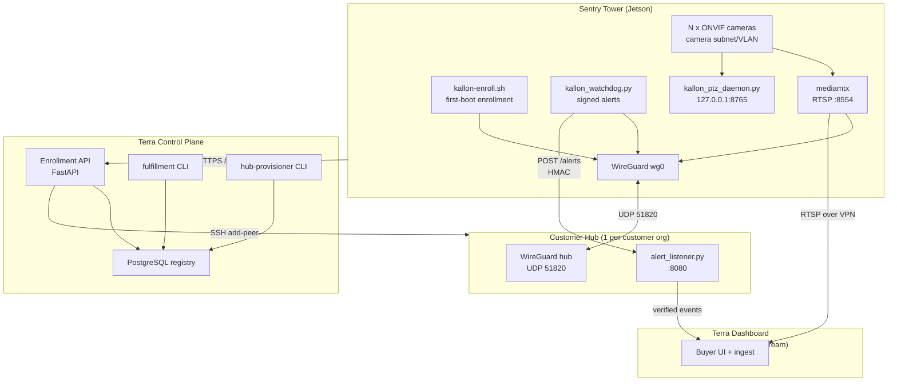
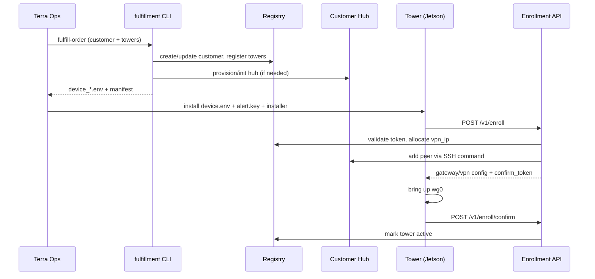

# Kallon Sentry Tower — Official Project Reference

**Terra Industries · Internal Engineering · field-test branch**

This document is the canonical technical reference for the Kallon platform as implemented in this repository. It explains:

- what has been built and why,
- every major component and its subcomponents,
- how components connect and exchange data,
- how to operate, onboard, verify, and diagnose the system.

It is written to be a single source of truth for engineering, factory, and platform operations.

**Documentation index:** [`docs/README.md`](README.md) — decision tree for all other docs.

---

## 1) System Purpose and Design Goals

Kallon is a sovereign edge surveillance platform. The design replaces vendor-cloud camera workflows with Terra-owned control and data paths.

Primary goals:

- Eliminate camera dependence on third-party cloud relay for core operation.
- Keep customer traffic isolated per organization.
- Provide turn-key deployment: factory config + first-boot auto-enrollment.
- Deliver two stable integration surfaces to the dashboard: RTSP video and signed alerts.
- Make deployment repeatable with idempotent scripts and clear contracts.

What v1 intentionally ships:

- Live video over VPN (`mediamtx` + RTSP)
- Signed event alerts over VPN (HMAC webhook)
- Registry, enrollment API, hub provisioning, and factory fulfillment tooling

What v1 intentionally does not ship:

- Historical playback / DVR archive
- Buyer-facing infrastructure configuration

---

## 2) Runtime Topology



Key architectural rules:

- Towers never connect to Postgres directly.
- Buyers never configure VPN peers or run CLI commands.
- Each customer organization has its own hub and VPN subnet.
- Dashboard integration consumes only documented RTSP and webhook contracts.

---

## 3) Repository Component Map

### 3.1 Control plane

- `registry/`
  - Storage abstraction and providers (`postgres` production, `sqlite` tests/lab)
  - Identity standards and schema migrations
- `infra/enrollment-api/`
  - FastAPI enrollment service (`/healthz`, `/v1/enroll`, `/v1/enroll/confirm`)
  - Peer-add backend driver (`subprocess` for production, `noop` for lab)
- `infra/hub-provisioner/`
  - Provisioner orchestration and provider adapters
  - Implemented providers: `manual`, `lightsail`
- `infra/fulfillment/`
  - Order automation (`kallon-fulfill-order`) generating per-tower factory env files

### 3.2 Hub

- `scripts/kallon-gateway-init.sh`
  - Bootstraps Ubuntu hub (WireGuard, UFW incl. **wg0 peer forwarding**, alert listener service)
- `scripts/kallon-gateway-ensure-forwarding.sh`
  - Idempotent **hub-only** migration: `ufw route allow in on wg0 out on wg0` (existing hubs)
- `scripts/kallon-gateway-add-peer.sh`
  - Idempotent WireGuard peer insertion/replacement
- `infra/hub/alert_listener.py`
  - HMAC verification endpoint and optional forwarder
- `infra/hub/wg_peers.py`
  - Canonical peer block merge/replace logic (also tested)

### 3.3 Tower / Jetson

- `scripts/kallon-jetson-install.sh`
  - Orchestrates install modules (`scripts/install/`)
- `scripts/kallon-enroll.sh`
  - First-boot enrollment client
- `scripts/kallon-wg-provision.sh`
  - On-device key generation + `wg0.conf` rendering
- `kallon_watchdog.py`
  - Sensor and health checks, alert signing/delivery
- `kallon_ptz_daemon.py`
  - Local PTZ command server
- `dahua_onvif_control.py`, `sentry_ptz_absolute.py`
  - ONVIF tooling and deterministic PTZ benchmark path

---

## 4) Data Model and Identity Contracts

Core schema (`registry/migrations/001_initial.sql`):

- `customers`
  - One row per customer org (`cust_*`)
  - Hub metadata (`gateway_endpoint`, `gateway_public_key`, `hub_alert_url`)
  - Status lifecycle (`pending_hub`, `active`, `suspended`)
- `towers`
  - One row per tower (`kln_<slug>_<6 digits>`)
  - Claim code, enrollment token hash, assigned VPN IP, WG pubkey, state
- `ip_allocations`
  - Per-customer monotonic host-octet allocator
- `audit_events`
  - Mutable action trail for lifecycle operations

Identity and token standards are implemented in `registry/identity.py` and documented in `docs/identity-and-secrets.md`.

Important invariants:

- Enrollment token plaintext is one-time factory output; DB stores hash only.
- Private keys are device/hub local only; registry stores public keys + metadata.
- Customer subnet and tower IP assignment are deterministic and isolated.

---

## 5) End-to-End Lifecycle



Steady-state data paths:

- Video: camera -> tower mediamtx -> WireGuard -> dashboard/relay peer
- Alerts: tower watchdog -> signed POST over WireGuard -> hub listener -> optional forward to dashboard ingest

---

## 6) Tower Installer Architecture (Module-by-Module)

Entry script: `scripts/kallon-jetson-install.sh`

Modules (in sequence):

- `00-preflight.sh`
  - Validates environment and required config before mutation
- `10-packages.sh`
  - Installs runtime dependencies (WireGuard, ffmpeg, python deps, etc.)
- `20-users-groups.sh`
  - Ensures required user/group membership for GPIO/I2C/video access
- `30-network-policy.sh`
  - Enforces WAN/camera NIC separation and route assertions
- `40-wireguard.sh`
  - Userspace compatibility setup + WG service provisioning
- `50-mediamtx.sh`
  - Installs and templates `mediamtx` for camera list
- `60-camera-route.sh`
  - Pins camera host routes to camera interface
- `70-app.sh`
  - App deployment into `/opt/kallon` and dependencies
- `75-enroll-service.sh`
  - First-boot enrollment service wiring
- `80-watchdogs.sh`
  - Watchdog/PTZ-related services and keys
- `85-tower-dashboard.sh`
  - **Optional** on-Jetson lab dashboard (loopback only; gated by `ENABLE_TOWER_DASHBOARD`)
- `90-firewall.sh`
  - RTSP exposure restrictions (`lo` + `wg0` only)
- `99-acceptance.sh`
  - Final health gate via acceptance checks

Operational behavior:

- Modules are idempotent by design.
- Specific modules can be targeted using `--only-module` and `--skip-module`.

---

## 7) Enrollment API: Runtime Behavior

Service: `infra/enrollment-api/app/main.py`

Endpoints:

- `GET /healthz`
  - Liveness probe
- `POST /v1/enroll`
  - Validates enrollment token
  - Allocates VPN IP from customer pool
  - Adds/updates tower peer on hub (production: subprocess backend)
  - Returns tower WireGuard/hub settings
- `POST /v1/enroll/confirm`
  - Marks tower as active after successful tunnel bring-up

Peer backend (`infra/enrollment-api/app/peering.py`):

- `KALLON_PEER_BACKEND=subprocess` (production)
- `KALLON_PEER_BACKEND=noop` (lab/testing only)

Production requirement:

- `subprocess` backend must be explicitly configured with a valid `KALLON_ADDPEER_CMD` and ops SSH key variables.

---

## 8) Hub Provisioning and Peer Management

### Provisioning

Provisioning command path:

- `infra/hub-provisioner/cli.py`
  - Creates or validates hub host
  - Runs `kallon-gateway-init.sh` remotely
  - Persists hub metadata in registry
  - Emits gateway manifest for Terra-internal consumption

Provider status:

- Implemented: `manual`, `lightsail`
- Planned in documentation but not implemented in code yet: `hetzner`, `ovh`, `proxmox`

### Peer management

Peer additions are idempotent and safe to repeat:

- `scripts/kallon-gateway-add-peer.sh`
  - Updates live interface (`wg set`)
  - Persists peer config block in `wg0.conf`
  - Keeps one peer block per device identity

---

## 9) Security and Secrets Model

Principles:

- Keep private key material local to tower/hub.
- Keep plaintext enrollment/token secrets out of source control and logs.
- Central registry stores identifiers and public metadata only.

Sensitive files and ownership (tower):

- `/etc/wireguard/jetson.private` (0600 root:root)
- `/etc/wireguard/wg0.conf` (0600 root:root)
- `/etc/kallon/device.env` (0640 root:khalifa)
- `/etc/kallon/alert.key` (0640 root:khalifa)

Sensitive files and ownership (hub):

- `/etc/wireguard/gateway.private` (0600)
- `/etc/kallon/alert.key` (restricted mode)

Control-plane secure defaults:

- Postgres local/private exposure only
- Enrollment API fronted by HTTPS
- Hub ops SSH identity centralized and controlled

---

## 10) Hardware Setup (Physical and Wiring)

This section defines the physical build assumptions for deployment and troubleshooting.

### 10.1 Tower hardware stack

- Jetson Orin platform (Orin Nano on bench, Orin NX target for production scale)
- ONVIF-compatible IP cameras (Dahua used on bench)
- Managed PoE switch for production camera VLAN isolation
- Tamper sensors:
  - MPU-6050 (motion/impact over I2C)
  - Reed switch (door/open tamper)
  - Digital LDR module (light intrusion)
- Optional field hardware:
  - LTE modem (WAN fallback interface)
  - NVMe SSD (future SMART checks and local durability)

### 10.2 Physical network layout

```text
[Cameras] --PoE--> [Managed Switch / Camera VLAN] --eth--> [Jetson]
                                                        |
                                                camera-only subnet

[Jetson Wi-Fi] -------------------------------> Internet (primary WAN)
[Jetson LTE usb0/wwan0] ----------------------> Internet (fallback WAN)
[Jetson wg0] ---------------------------------> Customer hub WireGuard (UDP 51820)
```

Network intent:

- `WAN_IFACE` (typically Wi-Fi) carries internet, enrollment, SSH, WireGuard egress.
- `CAMERA_IFACE` never carries default route.
- `WAN_FALLBACK_IFACE` is demoted by route metric and only used when primary WAN fails.

### 10.3 Jetson sensor wiring (Rev A)

Reference: `docs/hardware-wiring.md`

- Power:
  - 3.3V: J12 pin `1`
  - GND: J12 pin `6`
- MPU-6050:
  - SDA: pin `3` (I2C bus 7)
  - SCL: pin `5`
  - INT: pin `29`
  - Address: `0x68` (default)
- Reed switch:
  - Signal: pin `31` (door open => HIGH)
  - External pull-up to 3.3V with 10k resistor
- LDR digital module:
  - Signal: pin `33` (active-low, bright => LOW)

### 10.4 Bench vs production profile

- Bench commonly uses direct camera cable and home LAN addressing.
- Production uses managed switch + dedicated camera subnet/VLAN (e.g. `192.168.10.0/24`).
- The installer supports both through `device.env`; the route assertions are the same.

---

## 11) Active Services, Timers, and Schedules

This section lists expected long-running services and periodic schedules in a healthy deployment.

### 11.1 Tower (Jetson) services

| Service | Type | Purpose | Trigger/Frequency |
|---|---|---|---|
| `wg-quick@wg0.service` | systemd service | WireGuard tunnel | boot + manual restart |
| `mediamtx.service` | systemd service | RTSP rebroadcast (`:8554`) | continuous |
| `kallon-watchdog.service` | systemd service | Tamper/health monitoring + alert sends | continuous |
| `kallon-ptz-daemon.service` | systemd service | ONVIF control endpoint (`127.0.0.1:8765`) | continuous |
| `kallon-camera-route.service` | oneshot service | Camera route pinning to camera NIC | at boot / re-run as needed |
| `kallon-enroll.service` | oneshot service | First-boot enrollment | once (skipped after `.enrolled`) |
| `kallon-wg-watchdog.timer` | systemd timer | handshake watchdog scheduler | every 30s |
| `kallon-wg-watchdog.service` | oneshot service | restart WG if stale | fired by timer |

Optional lab-dashboard services (only when `ENABLE_TOWER_DASHBOARD=1`; see `docs/tower-lab-dashboard.md`):

| Service | Type | Purpose | Bind |
|---|---|---|---|
| `kallon-tower-dashboard.service` | systemd service | Lab SPA + ingest gateway | `127.0.0.1:8766` |
| `kallon-tower-alert-listener.service` | systemd service | Local HMAC alert sink → dashboard ingest | `127.0.0.1:8080` |

Watchdog extensions when the lab dashboard is enabled:

- `GET /status` and `GET /healthz` on `127.0.0.1:8770` (status API thread inside `kallon-watchdog`)
- Optional alert mirror to `ALERT_WEBHOOK_URL_LOCAL` (default `http://127.0.0.1:8080/alerts`)

mediamtx loopback surfaces (rendered by `50-mediamtx.sh` on all towers; loopback-only):

- Control API: `127.0.0.1:9997`
- HLS: `127.0.0.1:8888` (`/camN/index.m3u8`)
- RTMP/WebRTC rebroadcasts disabled (`rtmp: no`, `webrtc: no`)

Tower schedule details:

- `kallon-wg-watchdog.timer`:
  - `OnBootSec=30`
  - `OnUnitActiveSec=30`
- `kallon_watchdog.py` defaults:
  - Poll interval: `10s` (`POLL_INTERVAL_SEC`)
  - Dedup window: `60s` per alert type (`DEDUP_WINDOW_SEC`)
  - Send retries: up to 3 attempts with 1/2/4s backoff

### 11.2 Hub services

| Service | Type | Purpose | Trigger/Frequency |
|---|---|---|---|
| `wg-quick@wg0.service` | systemd service | Hub WireGuard endpoint (`UDP 51820`) | continuous |
| `kallon-alert-listener.service` | systemd service | HMAC alert receiver (`:8080`) | continuous |

Hub network policy expectation:

- UDP `51820` open for WireGuard peers.
- TCP `8080` allowed from customer VPN subnet only.

### 11.3 Control plane services and schedules

| Service | Type | Purpose | Trigger/Frequency |
|---|---|---|---|
| PostgreSQL service | system service | Registry persistence | continuous |
| Enrollment API (`uvicorn`) | service (e.g. NSSM/systemd) | `/v1/enroll` and `/v1/enroll/confirm` | continuous |
| TLS reverse proxy | service | Public HTTPS front door for enrollment | continuous |
| `postgres-backup` task | scheduled task/cron | daily `pg_dump` backup | daily (recommended) |

---

## 12) End-to-End Setup Guide (Control Plane to Live Feed)

This is the complete implementation path for a fresh environment.

### Phase A — Control plane bootstrap

1. Install Postgres 16 and create:
   - DB: `kallon`
   - user: `kallon`
2. Set environment:
   - `KALLON_REGISTRY=postgres`
   - `DATABASE_URL=postgresql://...`
3. Initialize schema:
   - `python -m registry.cli init-schema`
4. Configure ops SSH identity (`terra-hub-ops.pem`) on control plane host.
5. Configure enrollment API service env:
   - `KALLON_PEER_BACKEND=subprocess`
   - `KALLON_ADDPEER_CMD=...kallon-gateway-add-peer.sh...`
6. Run enrollment API as persistent service.
7. Front with HTTPS and verify:
   - `GET https://<enroll-domain>/healthz` returns healthy.

### Phase B — Customer and hub provisioning

1. Run fulfillment/provisioning (recommended):
   - `python infra/fulfillment/cli.py <slug> ...`
2. Ensure customer row is `active` and hub fields are populated:
   - endpoint, gateway public key, alert URL.
3. Verify on hub:
   - `sudo wg show wg0`
   - alert listener service active.

### Phase C — Factory tower preparation

Per tower:

1. Copy generated `device_<device_id>.env` to tower.
2. Copy matching hub `alert.key` to tower (`/etc/kallon/alert.key`).
3. Run installer:
   - `sudo scripts/kallon-jetson-install.sh --env /etc/kallon/device.env`
4. Enable first-boot enrollment service:
   - `kallon-enroll.service`
5. Run acceptance:
   - `sudo scripts/kallon-acceptance.sh --env /etc/kallon/device.env`

### Phase D — First boot in field

1. Tower powers on and runs `kallon-enroll.sh`.
2. Tower posts to enrollment API (`/v1/enroll`).
3. API validates token, allocates IP, executes hub peer-add.
4. Tower receives WG config, starts tunnel, confirms enrollment.
5. Registry state transitions to tower `active`.

### Phase E — Operational verification

1. Registry confirms tower `active` with assigned `vpn_ip`.
2. Hub `wg show` displays tower peer with `/32`.
3. RTSP check from **NOC VPN peer** (not hub shell only):
   - `Test-NetConnection <tower-vpn-ip> -Port 8554` (Windows) or `nc -zv` (Linux)
   - `ffprobe -rtsp_transport tcp rtsp://<tower-vpn-ip>:8554/cam1`
   - Hub must allow `wg0 → wg0` FORWARD (`kallon-gateway-init.sh` or `kallon-gateway-ensure-forwarding.sh`)
4. Alert check:
   - trigger sensor event and confirm accepted webhook on hub listener.

If all pass, the tower is production-live for v1 use-case (live feed + signed alerts).

---

## 13) Operations: Standard Command Paths

### 10.1 Control plane startup

- Load control plane environment:
  - `scripts/load-control-plane.ps1`
- Initialize schema:
  - `python -m registry.cli init-schema`
- Provision customer and hub:
  - `python infra/fulfillment/cli.py ...` (preferred one-command order flow)

### 10.2 Tower provisioning

- Install factory env and alert key into `/etc/kallon/`
- Run installer:
  - `sudo scripts/kallon-jetson-install.sh --env /etc/kallon/device.env`
- Run enrollment:
  - `sudo scripts/kallon-enroll.sh --env /etc/kallon/device.env`
- Run acceptance:
  - `sudo scripts/kallon-acceptance.sh --env /etc/kallon/device.env`

### 10.3 Validation checks

- Registry:
  - `python -m registry.cli list-customers`
  - `python -m registry.cli list-towers --customer <id>`
- Hub:
  - `sudo wg show wg0`
  - `sudo ufw status verbose` — must include route rule: **allow in on wg0 out on wg0**
  - Legacy hubs: `sudo bash scripts/kallon-gateway-ensure-forwarding.sh` (hub VPS only)
- Tower:
  - `sudo wg show wg0`
  - `systemctl status mediamtx kallon-watchdog kallon-ptz-daemon`

---

## 14) Diagnostics and Fault Isolation

Use this sequence to isolate most field failures quickly.

1. **Enrollment unreachable**
- Check DNS/TLS endpoint used by `ENROLLMENT_URL`.
- Verify API service health (`/healthz`).
- Confirm tower WAN interface has internet route.

2. **Enroll returns auth/status errors**
- `401`: wrong/expired enrollment token in `device.env`.
- `409`: customer hub not active or missing metadata in registry.

3. **No WireGuard handshake after enroll**
- Verify peer-add execution on API host (subprocess backend + SSH key + command template).
- Verify hub UDP 51820 exposure and `wg0` service state.
- Verify tower `wg0.conf` endpoint/public key values from enroll response.

4. **RTSP unavailable over VPN (from NOC peer)**
- Check `mediamtx` service and camera source credentials/path on the tower.
- Confirm tower module 90 firewall allows RTSP on `wg0` (`lo` + `wg0` only).
- Verify client is a valid WireGuard peer in customer subnet.
- **Hub:** confirm `ufw route allow in on wg0 out on wg0` — ping to tower can work while TCP `:8554` fails without it. Run `kallon-gateway-ensure-forwarding.sh` on the **hub** (not Jetson). See `docs/postgres-windows-server-setup.md` §8.1.

5. **Alert delivery failures / signature rejection**
- Ensure tower and hub `/etc/kallon/alert.key` values match exactly.
- Check hub listener service status and bind settings.
- Confirm watchdog logs show HTTP delivery status and retry behavior.

6. **Route asymmetry / camera connectivity instability**
- Verify module 30/60 route assertions.
- Ensure camera interface has no default route.
- Confirm camera host routes are pinned to camera NIC.

---

## 15) Test Coverage vs Runtime Risk

Verified in repository tests:

- Registry lifecycle and allocation behavior
- Enrollment flow correctness and idempotency logic
- Peer persistence and key-rotation handling
- Fulfillment plan generation and device env rendering
- HMAC signing/verification primitives

Not fully covered by automated tests (operationally verified paths):

- Live Postgres + network deployment behavior
- Cloud-provider provisioning API paths
- End-to-end hardware/RTSP/iptables/systemd interactions
- Field WAN failover behavior under LTE degradation

Recommendation:

- Keep software tests as preflight.
- Keep acceptance and hub/tower runtime checks as mandatory deployment gate.

---

## 16) Current Known Contract Gaps to Resolve

The following are important to align before external integration hardening:

- Alert type casing may differ in older examples vs daemon enum values — canonical schema is `docs/alert-webhook.md` (aligned to `kallon_watchdog.py` as of June 2026).
- Provider references in docs/schema include adapters not yet implemented in code (e.g. Hetzner).
- Some lifecycle fields exist in schema but are not actively updated by runtime scripts (`acceptance_status`, `shipped_at`).

These are integration-quality issues, not architecture blockers, but should be reconciled in the next documentation/API contract pass.

---

## 17) Authoritative Supporting Docs

Use this file as the primary map, then these as focused runbooks:

- `docs/README.md` — documentation index and decision tree
- `docs/field-test-setup.md` — end-to-end execution path
- `docs/postgres-windows-server-setup.md` — production control-plane bring-up (hub §8)
- `docs/architecture-setup-guide.md` — layered infrastructure walkthrough
- `docs/order-fulfillment.md` — commercial flow to deployment (includes business walkthrough)
- `docs/identity-and-secrets.md` — identifier/secret standards
- `docs/alert-webhook.md` — integration contract (aligned to `kallon_watchdog.py`)
- `planning/work-plan.md` — living task status
- `planning/sovereign-stack-brief.md` — product intent
- `planning/mass-deployment-roadmap.md` — phases and deliverables
- `legacy/` — May 2025 bench docs (archived; do not follow for ops)

---

## 18) Definition of Operationally Healthy State

A deployment is considered healthy when all are true:

- Control plane API healthy and reachable over HTTPS.
- Customer hub status is active in registry with valid endpoint/public key.
- Tower enrolls without manual peer edits and transitions to active.
- WireGuard handshake remains fresh on both hub and tower.
- RTSP stream is reachable over VPN from approved peer.
- Watchdog alerts are accepted by hub listener with valid HMAC.
- Acceptance checks pass and route/firewall policies match intended topology.

This is the practical "go-live" standard for factory sign-off and field support.

