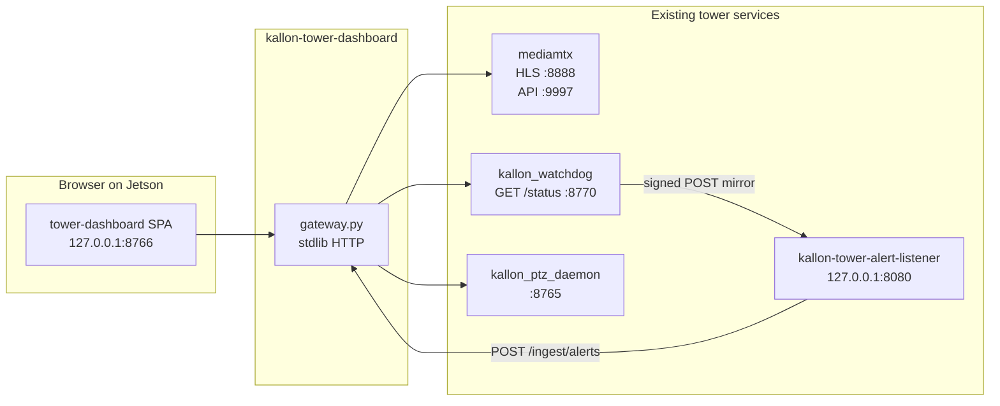

# Tower lab dashboard (on-Jetson)

Optional **loopback-only** console for the in-house bench tower: a monitor,
keyboard, and mouse plugged directly into the Jetson. It is **not** the Terra
buyer dashboard (`docs/alert-webhook.md` defines that integration separately).

Fleet towers leave `ENABLE_TOWER_DASHBOARD=0` (default). Only the lab unit
sets it to `1`.

## What it shows

| Page | Content |
|---|---|
| **Live feed & PTZ** | 2×2 HLS grid (`cam1`…`camN`), per-camera PTZ pad (hold-to-move) |
| **Recording** | Global ON/OFF toggle (`PUT /api/recording`) — MediaMTX live + persist `RECORD_ENABLE` |
| **Monitor** | Live sensor tiles (door, cover, temp, impact, streams, disk) + alert stream |

All data is **ingested** from existing tower surfaces — no duplicate monitoring
logic in the dashboard.

## Architecture



### Data paths

| UI need | Source | How the gateway gets it |
|---|---|---|
| Camera video | mediamtx HLS | Browser plays `http://127.0.0.1:8888/camN/index.m3u8` directly |
| Stream readiness | mediamtx Control API | `GET /api/streams` → proxied `/v3/paths/list` |
| Sensor snapshot | Watchdog status API | `GET /api/status` → proxied `GET /status` |
| Live alerts | Local alert listener | Watchdog mirrors signed alerts → listener → `POST /ingest/alerts` → SSE |
| PTZ buttons | PTZ daemon | `POST /api/ptz` → TCP JSON to `127.0.0.1:8765` |

**Video codecs:** module `50-mediamtx.sh` sets `hlsVariant: fmp4`, which remuxes
H.264 and H.265 into HLS without per-camera code. For reliable playback in
Chromium on the Jetson kiosk, provision Dahua cameras with **H.264 on the
substream** (`subtype=1`) during initial IP setup — see `docs/field-test-setup.md`.

## Camera provisioning (Dahua)

For reliable kiosk video, set substream to H.264 in each camera's web UI when you
provision them. Typical path: **Setup → Camera → Video → Encode** → substream →
**H.264**. Confirm with `ffprobe` on the substream RTSP URL (`codec_name` should
be `h264`). RTSP rebroadcast and VLC over WireGuard work with H.265; the kiosk
browser does not.

## Loopback ports (lab tower only)

| Port | Service | Bind | Purpose |
|---|---|---|---|
| 8766 | `kallon-tower-dashboard` | 127.0.0.1 | SPA + gateway API |
| 8770 | `kallon-watchdog` status thread | 127.0.0.1 | `GET /status`, `GET /healthz` |
| 8765 | `kallon-ptz-daemon` | 127.0.0.1 | PTZ JSON/TCP |
| 8888 | mediamtx HLS | 127.0.0.1 | HLS fallback (lowLatency variant) |
| 8889 | `kallon-tower-mjpeg-proxy` | 127.0.0.1 | MJPEG `/camN` — near-real-time kiosk video |
| 9997 | mediamtx Control API | 127.0.0.1 | Stream readiness |
| 8080 | `kallon-tower-alert-listener` | 127.0.0.1 | Local HMAC alert sink |

RTSP `:8554` is unchanged (firewalled to `lo` + `wg0` only).

## Configuration (`/etc/kallon/device.env`)

`device.env` must be installed at `/etc/kallon/device.env` before the installer
runs (`docs/identity-and-secrets.md` §3.2). Dashboard-related keys:

```bash
ENABLE_TOWER_DASHBOARD=1
TOWER_DASHBOARD_PORT=8766
TOWER_STATUS_API_PORT=8770
TOWER_DASHBOARD_KIOSK=1           # Chromium kiosk on desktop login

# Optional overrides (defaults shown):
# ALERT_WEBHOOK_URL_LOCAL=http://127.0.0.1:8080/alerts
# TOWER_STATUS_API_ENABLE=1       # implied when ENABLE_TOWER_DASHBOARD=1
```

When the dashboard is enabled, the watchdog automatically:

- starts the status API on `127.0.0.1:${TOWER_STATUS_API_PORT}`
- mirrors alerts to `http://127.0.0.1:8080/alerts` (unless
  `ALERT_WEBHOOK_URL_LOCAL` is set explicitly)

Primary hub delivery (`ALERT_WEBHOOK_URL`) is unchanged.

## Installation

Run the full installer, or only the dashboard module after core provisioning:

```bash
sudo scripts/kallon-jetson-install.sh --only-module 85
```

Module `85-tower-dashboard.sh`:

1. Copies `infra/tower-dashboard/` → `/opt/kallon/tower-dashboard/`
2. Copies `infra/hub/alert_listener.py` → `/opt/kallon/alert_listener.py`
3. Renders and enables `kallon-tower-dashboard.service` and
   `kallon-tower-alert-listener.service`
4. Optionally installs Chromium kiosk autostart
5. Restarts `kallon-watchdog` so the status API and alert mirror activate

### Desktop launcher vs kiosk autostart

| Mechanism | Path | When | Browser mode |
|---|---|---|---|
| **Applications menu** | `~/.local/share/applications/kallon-tower-dashboard.desktop` | Operator clicks launcher | Windowed (`--app=…`) |
| **Login autostart** | `~/.config/autostart/kallon-tower-dashboard.desktop` | Every desktop login (`TOWER_DASHBOARD_KIOSK=1`) | Fullscreen kiosk |

Disable only the login kiosk with `TOWER_DASHBOARD_KIOSK=0`; the Applications menu launcher remains.

To remove/disable, set `ENABLE_TOWER_DASHBOARD=0` and re-run module 85.

Example unit files: `deploy/tower-dashboard.service.example`,
`deploy/kallon-tower-alert-listener.service.example`,
`deploy/tower-dashboard.desktop.example`,
`deploy/tower-dashboard-kiosk.desktop.example`.

## Manual smoke checks (on the Jetson)

```bash
# Gateway
curl -s http://127.0.0.1:8766/healthz
curl -s http://127.0.0.1:8766/api/config | jq .

# Watchdog status API (when dashboard enabled)
curl -s http://127.0.0.1:8770/status | jq .

# PTZ
echo '{"id":1,"method":"list_cameras","params":{}}' | nc -q 1 127.0.0.1 8765

# mediamtx paths
curl -s http://127.0.0.1:9997/v3/paths/list | jq .

# Open in browser (or rely on kiosk autostart)
xdg-open http://127.0.0.1:8766/
```

Service status:

```bash
systemctl status kallon-tower-dashboard kallon-tower-alert-listener \
  kallon-watchdog kallon-ptz-daemon mediamtx
```

## Code layout

| Path | Role |
|---|---|
| `infra/tower-dashboard/gateway.py` | stdlib ingest gateway |
| `infra/tower-dashboard/web/` | Static SPA (HTML/CSS/JS + vendored `hls.js`) |
| `scripts/install/85-tower-dashboard.sh` | Optional installer module |
| `kallon_watchdog.py` | Status API + optional local alert mirror |
| `kallon_ptz_daemon.py` | Multi-camera PTZ (`camera` param, `list_cameras`) |

## Related docs

- `docs/project-official-reference.md` — fleet services and installer modules
- `docs/dev-onvif-ptz.md` — PTZ daemon protocol
- `docs/alert-webhook.md` — Terra buyer integration (separate from this tool)
