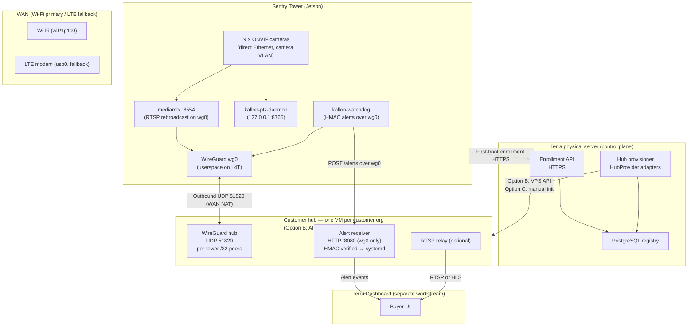

# Kallon Sentry Tower — Mass Deployment Roadmap

**Terra Industries · Internal Engineering · v2.1 · June 2026**

| Related doc | Role |
|-------------|------|
| `kallon_sovereign_stack_brief.md` | Product vision, phase exit criteria (v2.0) |
| `kallon_current_state.md` | Live bench state, verified services, credential inventory |
| `Considering physical server for VPS.md` | Control plane layout, hub hosting options, vendor lock-in |
| `jetson-lab-steps-8-10.md` | Phase 3 lab walkthrough |
| `phase4-setup-guide.md` | Phase 4 tamper / health bring-up |
| `HOW_TO_USE.md` | ONVIF & PTZ daemon CLI reference |

---

## 1. Mental Model — Who Does What

This is the most important thing to establish before anything else.

| Actor | Role | Touches a terminal? |
|-------|------|---------------------|
| **Buyer (end customer)** | Buys towers, powers them on, monitors from Terra dashboard | **Never** |
| **Terra manufacturing / ops** | Flash, provision, QA, registry, hub automation, field support | Internal tools only |
| **Terra platform (physical server)** | Postgres registry, enrollment API, hub provisioner, ops | Automated — no console per tower or customer |
| **Enterprise tier (Option C)** | Hub on customer-owned or on-prem Ubuntu host | Same scripts; `HubProvider=manual` — contract-specific |

> **The buyer is not an IT engineer.** There is no cloud console, no WireGuard config, no terminal.
> Terra provisions each customer’s hub via script; the buyer gets a dashboard.

---

## 2. Production Architecture



**Key principles:**

- Camera subnet has **no internet path** — Jetson is the only WAN-capable device in the tower.
- WireGuard egress is **outbound from the Jetson** — works through Wi-Fi or LTE NAT without port forwarding.
- **Terra physical server** hosts Postgres + enrollment API + hub provisioner — towers never touch the DB directly.
- Terra provisions **one hub VM per customer org** via **`kallon-hub-provision`** — no cloud console, no AWS dependency.
- **Default hub host:** external VPS via API (**AWS Lightsail** first adapter; Hetzner/OVH/DO as additional `HubProvider`s). **Option C:** `kallon-gateway-init.sh` on customer on-prem Ubuntu (enterprise).
- Buyer interacts only with the **Terra dashboard**.

### 2.1 Terra control plane (physical server)

| Component | Role |
|-----------|------|
| **PostgreSQL** | Fleet registry from day 1 — customers, towers, IP allocations, audit |
| **Enrollment API** | Tower first-boot; backed by Postgres |
| **Hub provisioner** | Creates customer hub VMs via `HubProvider` adapters |
| **Backups** | `pg_dump`; registry export |
| **TLS termination** | Caddy/nginx in front of enrollment API |

Postgres is **not** exposed to the public internet. Enrollment API is HTTPS-only.

See `Considering physical server for VPS.md` for layout and vendor-lock-in notes.

### 2.2 Hub hosting — Option B (default) and Option C

| Option | Mechanism | When |
|--------|-----------|------|
| **B — API VPS** (default) | `kallon-hub-provision cust_acme --provider lightsail` (or `hetzner`, `ovh`, …) | Retail customers; UDP 51820 |
| **C — Manual / on-prem** | `kallon-hub-provision cust_acme --provider manual --host <ip>` → SSH + `kallon-gateway-init.sh` | Enterprise, sovereign tier, customer DC |
| **A — Local VM** (optional) | `--provider proxmox` on physical server | Lab / fallback only |

All options produce the same **`gateway_manifest.json`** and registry row. Core contracts (WireGuard, RTSP, HMAC alerts) are unchanged.

**Hub provisioner interface** (no Terraform/AWS in core):

```text
infra/hub-provisioner/
  ├── interface.py       # HubProvider protocol
  ├── lightsail.py       # default adapter (lab-proven)
  ├── hetzner.py         # secondary adapter
  ├── manual.py          # Option C
  └── cli.py             # kallon-hub-provision
```

---

## 3. Identity & Secrets Standards

Lock these in from day one. All scripts, templates, and registry entries must follow these formats.

### Identifiers (human-readable, log-safe)

| Field | Format | Example |
|-------|--------|---------|
| **customer_id** | `cust_<slug>` | `cust_acme` |
| **device_id** | `kln_<slug>_<6-digit serial>` | `kln_acme_000042` |
| **gateway_id** | `gw_<slug>` | `gw_acme` |
| **tower_group_id** (optional) | `grp_<slug>_<site>` | `grp_acme_north` |
| **claim_code** | `clm_<base64url 16 bytes>` | `clm_8f3kLmNpQr...` |

### VPN IP allocation (per customer `/24`)

| Address | Role |
|---------|------|
| `x.x.x.1` | Hub (`wg0` gateway) |
| `x.x.x.10` | Reserved — NOC / ops laptop WG peer |
| `x.x.x.2–.99` | Towers (factory allocator) |
| `x.x.x.100–.254` | Spare / future |

Customer VPN subnets are allocated from a Terra master table (e.g. `cust_acme → 10.50.0.0/24`, `cust_beta → 10.51.0.0/24`).

### Cryptographic material

| Secret | Format | Stored where |
|--------|--------|--------------|
| WireGuard private key | `wg genkey` → base64 44 chars | `/etc/wireguard/jetson.private` mode `600` — **never in registry** |
| WireGuard public key | derived | Registry + hub peer block |
| Alert HMAC key | `openssl rand -base64 32` | `/etc/kallon/alert.key` on **tower + hub**, mode `600` |
| Camera password | string | `/etc/kallon/device.env` only, mode `640` |
| Enrollment token | `enr_<base64url 32 bytes>` | Pre-baked in `device.env` at factory; one-time use |

---

## 4. Three Flows

### 4.1 Tower First-Boot Enrollment

```mermaid
sequenceDiagram
    participant F as Factory
    participant T as Tower (Jetson)
    participant E as Enrollment API
    participant R as Registry
    participant H as Customer Hub

    F->>R: Register device_id, serial, claim_code, customer_id
    F->>T: Flash with device.env (enrollment_url, enrollment_token, device_id)

    Note over T: First boot in field
    T->>E: POST /v1/enroll { device_id, wg_public_key, enrollment_token }
    E->>R: Lookup device → customer → allocate vpn_ip
    E->>H: kallon-gateway-add-peer (wg_public_key, vpn_ip/32)
    E-->>T: { vpn_ip, gateway_endpoint, gateway_pubkey, alert_webhook_url }
    T->>T: Write wg0.conf, device.env; start WireGuard
    T->>H: WireGuard handshake (outbound UDP 51820)
    T-->>E: POST /v1/enroll/confirm { device_id, handshake: ok }
    E->>R: Mark tower active
    Note over T,H: Tower live — RTSP + alerts flowing
```

> **Claim code path:** Buyer (or Terra ops) scans QR label in the dashboard to link tower serial to an org before or after shipping. Tower auto-enrolls on first boot; claim code determines which customer hub it joins.

### 4.2 Video Path (steady state)

```text
Camera ──RTSP/554──► mediamtx (Jetson :8554) ──RTSP/TCP over wg0──► Customer Hub ──► Terra Dashboard
                                                                                     (or NOC peer RTSP)
```

- `mediamtx` pulls camera stream **on demand** via local RTSP.
- Rebroadcasts on `wg0` interface only (iptables rules).
- Dashboard receives stream via hub relay or direct VPN peer.

### 4.3 Alert Path (steady state)

```text
Sensor (GPIO/I2C/ffprobe) ──► kallon-watchdog ──HMAC POST over wg0──► Alert receiver (hub :8080) ──► Dashboard
```

- HMAC-SHA256 signed JSON; `X-Kallon-Signature` header.
- 60-second dedup per alert type; 3 retries with backoff.
- Alert receiver is a **systemd** service on the hub — not `nohup`.

---

## 5. Registry Design

### Storage — Postgres on Terra physical server (day 1)

The registry lives on **PostgreSQL 16** on Terra’s self-hosted physical server from implementation start. Factory scripts and the enrollment API call a **`kallon-registry` CLI / Python module** only — never raw SQL in install scripts, never Google Sheets as source of truth.

```text
KALLON_REGISTRY=postgres          ← production (default)
DATABASE_URL=postgresql://...       ← LAN / ops VPN only; not public
```

A `RegistryProvider` interface allows an in-memory or SQLite provider **for unit tests only** — not for factory or field use.

```text
registry/
  ├── migrations/001_initial.sql
  ├── interface.py         # RegistryProvider protocol
  ├── postgres_provider.py # production (physical server)
  ├── sqlite_provider.py   # unit tests only
  └── cli.py               # create-customer, register-tower, allocate-ip, get-config
```

### Schema

**`customers`**

| Column | Type | Example |
|--------|------|---------|
| customer_id | TEXT PK | cust_acme |
| display_name | TEXT | Acme Security |
| vpn_subnet | TEXT | 10.50.0.0/24 |
| gateway_endpoint | TEXT | 203.0.113.42:51820 |
| gateway_public_key | TEXT | base64 |
| hub_alert_url | TEXT | http://10.50.0.1:8080/alerts |
| hub_provider | TEXT | lightsail \| hetzner \| manual \| proxmox |
| hub_host_id | TEXT | provider instance ID or manual host |
| status | TEXT | pending_hub \| active \| suspended |
| created_at | TIMESTAMPTZ | |

**`towers`**

| Column | Type | Example |
|--------|------|---------|
| device_id | TEXT PK | kln_acme_000042 |
| customer_id | TEXT FK | cust_acme |
| group_id | TEXT | grp_acme_north |
| vpn_ip | TEXT | 10.50.0.2 |
| wg_public_key | TEXT | base64 (filled at provision) |
| claim_code | TEXT | clm_... |
| manufactured_at | DATETIME | |
| enrolled_at | DATETIME | null until first boot |
| acceptance_status | TEXT | pending \| pass \| fail |
| shipped_at | DATETIME | |

**`ip_allocations`**

| Column | Type |
|--------|------|
| customer_id | TEXT FK |
| next_host_octet | INTEGER |

**`audit_events`**

| Column | Type |
|--------|------|
| id | INTEGER PK |
| event_type | TEXT |
| entity_id | TEXT |
| actor | TEXT |
| payload_json | TEXT |
| created_at | DATETIME |

> **Secrets in registry:** Only **public** keys and metadata. Private keys and HMAC keys stay on-device or in a secrets vault. Never stored in the registry DB.

---

## 6. Installer Architecture

`kallon-jetson-install.sh` is the **single entry point** for any Jetson, regardless of pilot or production. It calls modular sub-scripts in order. Each module is idempotent and can be re-run.

```text
kallon-jetson-install.sh
  └── scripts/install/
        ├── 00-preflight.sh       Verify arm64, root, read device.env
        ├── 10-packages.sh        apt + pip; wireguard-tools, wireguard-go,
        │                         ffmpeg, python3-pip, iptables-persistent,
        │                         i2c-tools, jetson-stats (optional)
        ├── 20-users-groups.sh    khalifa in gpio, i2c, video; sudoers scoped
        ├── 30-network-policy.sh  Dual-NIC policy (critical — see §7)
        ├── 40-wireguard.sh       Userspace drop-in, kallon-wg-provision,
        │                         enable wg-quick@wg0 + watchdog timer
        ├── 50-mediamtx.sh        Pin ARM64 binary version, mediamtx.yml
        │                         from template (N cameras from device.env)
        ├── 60-camera-route.sh    kallon-camera-route.service (per CAMERA_IFACE)
        ├── 70-app.sh             /opt/kallon from git tag or tarball,
        │                         pip install -r requirements.txt
        ├── 80-watchdogs.sh       kallon-watchdog, kallon-wg-watchdog.timer,
        │                         kallon-ptz-daemon (optional)
        ├── 90-firewall.sh        iptables: RTSP 8554 on lo + wg0 only;
        │                         never block SSH on WAN_IFACE
        └── 99-acceptance.sh      Route check, WG handshake, local ffprobe,
                                  enrollment dry-run; exit 1 on fail
```

`kallon-jetson-install.sh --env /etc/kallon/device.env [--skip-module 30] [--only-module 99]`

---

## 7. Network Policy (Module 30)

Production: **one Ethernet port** to the managed switch (camera VLAN only); **Wi‑Fi is always WAN**. Bench may use direct camera cable — same policy rules apply.

```text
  [Cameras] ──PoE──► [Managed switch — Camera VLAN 10]
                           │
                     [Jetson eth]  ← cameras only (no default route)
                           │
  [Internet] ◄── [Jetson Wi‑Fi]   ← WAN only (SSH, WG, enrollment)
```

| Interface | Role | Default route? | Address |
|-----------|------|----------------|---------|
| `wlP1p1s0` (Wi‑Fi) | **WAN** — internet, SSH, WireGuard, enrollment | **Yes** | DHCP or static |
| `enP8p1s0` (eth) | Camera VLAN via switch | **No** | e.g. `192.168.10.2/24`, **no gateway** |
| `wg0` | Terra/customer VPN | Via WG peer | `10.50.x.x/24` |

**Switch (Phase 4):** camera ports on VLAN 10; Jetson eth on VLAN 10; ACL cameras → Jetson only; no camera internet.

**Rules enforced by `30-network-policy.sh`:**

1. Default route **only** on `WAN_IFACE` (`wlP1p1s0` in production).
2. `CAMERA_IFACE` gets **no default gateway** — ever.
3. `kallon-camera-route.service` pins each camera IP to `CAMERA_IFACE`.
4. Boot assertions: `ip route get <camera_ip>` → `CAMERA_IFACE`; `ip route get 1.1.1.1` → `WAN_IFACE`.
5. SSH debug always via Wi‑Fi WAN IP.
6. **Field LTE (Phase 5):** `usb0` may replace Wi‑Fi as `WAN_IFACE`; eth remains camera-only.

`device.env` (production default):

```bash
WAN_MODE=wifi
WAN_IFACE=wlP1p1s0
WAN_FALLBACK_IFACE=usb0   # LTE; higher route metric than Wi-Fi
CAMERA_IFACE=enP8p1s0
CAMERA_SUBNET=192.168.10.0/24
CAMERA_JETSON_IP=192.168.10.2/24
CAMERA_IPS=192.168.10.108,192.168.10.109
```

---

## 8. Customer Hub Provisioning

**One hub per customer org, created once by `kallon-hub-provision` on the Terra physical server — never by cloud console.**

### Step 1 — `kallon-hub-provision` (runs on control plane)

Orchestrates hub VM creation via `HubProvider`, then runs remote init.

```bash
# Option B — default (API VPS)
kallon-hub-provision cust_acme --provider lightsail --region us-east-2

# Option C — enterprise / on-prem
kallon-hub-provision cust_acme --provider manual --host 203.0.113.42 --ssh-user ubuntu
```

| Provider step | Action |
|---------------|--------|
| 1 | Allocate `vpn_subnet` in Postgres; set `status=pending_hub` |
| 2 | **Option B:** call VPS API → create Ubuntu VM, open UDP 51820, record `hub_host_id` |
| 3 | **Option C:** verify SSH to `--host`; skip VM creation |
| 4 | Remote-run `kallon-gateway-init.sh` on the hub host |
| 5 | Write `gateway_manifest.json`; update registry `status=active` |

No AWS, no Terraform, no manual WireGuard editing. Swapping VPS vendor = new `HubProvider` adapter only.

### Step 2 — `kallon-gateway-init.sh` (runs on hub VM — any provider)

| Step | Action |
|------|--------|
| 1 | Install `wireguard-tools`, `ufw`, `python3` |
| 2 | Generate gateway WG keypair → `/etc/wireguard/gateway.private` + `.public` |
| 3 | Write `/etc/wireguard/wg0.conf` (`[Interface]` only; peers added later) |
| 4 | `net.ipv4.ip_forward = 1` |
| 5 | UFW: **UDP 51820** open; **TCP 8080** from `vpn_subnet` only; deny rest |
| 6 | Install alert receiver as systemd (`kallon-alert-listener.service`) |
| 7 | Write customer row to registry (gateway pubkey, endpoint, status=active) |
| 8 | Output **`gateway_manifest.json`** (see below) |

### `gateway_manifest.json` (Terra internal — never sent to buyer)

```json
{
  "customer_id": "cust_acme",
  "gateway_id": "gw_acme",
  "gateway_endpoint": "203.0.113.42:51820",
  "gateway_public_key": "<base64>",
  "vpn_subnet": "10.50.0.0/24",
  "alert_webhook_url": "http://10.50.0.1:8080/alerts",
  "enrollment_peer_url": "https://203.0.113.42:8443/v1/peers"
}
```

This is consumed by the **enrollment API** and factory scripts — not sent to the buyer.

### `kallon-gateway-add-peer.sh`

Adds a tower as a WireGuard peer on the hub. Called by the enrollment API on first-boot, and manually at factory for pre-provisioned towers.

```bash
kallon-gateway-add-peer.sh \
  --gateway-host 203.0.113.42 \
  --pubkey <jetson_public_key> \
  --vpn-ip 10.50.0.2/32 \
  --device-id kln_acme_000042
```

Idempotent — safe to re-run. Persists peer to `wg0.conf` and calls `wg set` live.

---

## 9. Factory Flow (per tower)

```mermaid
flowchart LR
    A["1 — Flash golden image\nor stock L4T + installer"] --> B
    B["2 — Assign device_id\n+ serial label + QR\n(claim_code on label)"] --> C
    C["3 — Write /etc/kallon/device.env\nfrom registry row"] --> D
    D["4 — kallon-wg-provision.sh\nGenerate jetson keypair\nRender wg0.conf"] --> E
    E["5 — kallon-jetson-install.sh\n(all 10 modules)"] --> F
    F["6 — kallon-acceptance.sh\nRoute ✓  WG ✓  ffprobe ✓\nalert dry-run ✓"] --> G
    G["7 — Record wg_public_key\n+ acceptance pass\nin registry"] --> H
    H["Ship 📦\ndevice.env baked in\nclaim_code on label"]
```



**Time target:** &lt; 30 minutes per unit once scripts are automated.

---

## 10. Phase Breakdown

Phases are **sequential milestones** not time-boxed sprints. Each phase has clear entry and exit conditions.

---

### ✅ Phase 0 — Bench Validated (Done)

Everything verified live on the bench as of May 2026.

| What | Status |
|------|--------|
| Camera reachable via direct Ethernet (ONVIF :80, RTSP :554) | ✅ |
| PTZ daemon running (`127.0.0.1:8765`) | ✅ |
| mediamtx rebroadcasting on wg0 | ✅ |
| WireGuard tunnel (Jetson ↔ VPS ↔ NOC) | ✅ |
| kallon-watchdog: MPU, reed, LDR, RTSP, temp alerts → HTTP 200 | ✅ |
| HMAC end-to-end (tamper_impact alert verified) | ✅ |
| All systemd units: watchdog, ptz-daemon, mediamtx, camera-route, wg-watchdog | ✅ |
| deploy/ templates in repo | ✅ |

---

### 🔧 Phase 1 — Packaged Installer (Current priority)

**Goal:** Any fresh Jetson → working bench-equivalent in one command.

**Entry:** Phase 0 complete.

| Deliverable | Notes |
|-------------|-------|
| `deploy/device.env.example` | All vars including `WAN_IFACE`, `CAMERA_IFACE`, `CAMERA_IPS` |
| `deploy/wg0.conf.example` | Jetson-side WireGuard template |
| `scripts/install/00–99` sub-modules | Packages, users, network policy, WG, mediamtx, app, watchdogs, firewall, acceptance |
| `scripts/kallon-jetson-install.sh` | Orchestrates modules; idempotent; `--env FILE` |
| `scripts/kallon-wg-provision.sh` | Keygen + render `wg0.conf`; no rotate unless `--regenerate-keys` |
| `scripts/kallon-acceptance.sh` | Route, WG handshake, ffprobe, dry-run alert |
| `deploy/iptables-rebroadcast.rules.example` | wg0 + lo only for :8554 |

**Exit:** Run installer on a second clean SD card → full bench state verified by `kallon-acceptance.sh`.

---

### 🔧 Phase 2 — Registry & Enrollment API (Current priority, parallel with Phase 1)

**Goal:** Postgres registry on Terra physical server; enrollment API live; first-boot enrollment automated.

**Entry:** Phase 1 complete. Postgres running on physical server.

| Deliverable | Notes |
|-------------|-------|
| Postgres 16 on physical server | Registry DB; LAN/ops VPN only; daily `pg_dump` |
| `registry/migrations/001_initial.sql` | Schema for customers, towers, ip_alloc, audit |
| `registry/postgres_provider.py` + CLI | `create-customer`, `register-tower`, `allocate-ip` |
| `registry/interface.py` | `RegistryProvider` protocol |
| `registry/sqlite_provider.py` | Unit tests only |
| `infra/enrollment-api/` | FastAPI; `POST /v1/enroll`; TLS via reverse proxy; backed by Postgres |
| `scripts/kallon-enroll.sh` | Jetson first boot; calls enrollment API |
| `deploy/kallon-enroll.service.example` | One-shot; `ConditionPathExists=!/etc/kallon/.enrolled` |
| `docs/identity-and-secrets.md` | ID formats, file locations, rotation procedures |

**Exit:** Two towers enroll against enrollment API on physical server; Postgres rows updated; acceptance passes.

---

### 🔧 Phase 3 — Hub Automation & Hardening (Follows Phase 2)

**Goal:** `kallon-hub-provision` creates Option B hubs via VPS API; Option C supported; hubs hardened.

**Entry:** Phase 2 complete.

| Deliverable | Notes |
|-------------|-------|
| `infra/hub-provisioner/interface.py` | `HubProvider` protocol |
| `infra/hub-provisioner/lightsail.py` | Default Option B adapter (lab-proven) |
| `infra/hub-provisioner/hetzner.py` | Secondary Option B adapter |
| `infra/hub-provisioner/manual.py` | Option C — SSH to existing Ubuntu host |
| `scripts/kallon-hub-provision` | CLI; writes registry + `gateway_manifest.json` |
| `scripts/kallon-gateway-init.sh` | On hub VM: WG hub, UFW, alert listener systemd |
| `scripts/kallon-gateway-add-peer.sh` | Idempotent peer add; called by enrollment API |
| `docs/customer-gateway.md` | Terra-internal runbook; Option B + C |
| `docs/alert-webhook.md` | Dashboard integration contract (RTSP + HMAC) |
| Hub UFW hardened | 51820/udp open; 8080/tcp from VPN subnet only |
| Two-tower test on one hub | `cust_acme` with two towers on one API-provisioned VPS |

**Exit:** `kallon-hub-provision cust_lab --provider lightsail` (or manual for lab) → two towers enrolled → HMAC verified → no hand-edited `wg0.conf`.

---

### 📋 Phase 4 — Pilot Sign-Off (Follows Phase 3)

**Goal:** One real installation end-to-end; zero-egress proof; gateway hardened; dashboard contract verified.

**Entry:** Phases 1–3 complete; managed PoE switch acquired.

| Task | Notes |
|------|-------|
| Managed PoE switch + camera VLAN | Phase 1 exit criterion hardware |
| 24h zero-egress Wireshark capture | Done **once** on pilot unit; assumed for subsequent production builds if config identical |
| Jetson iptables applied and tested | RTSP on `wg0`/`lo` only; SSH via `WAN_IFACE` survives |
| PTZ 1,000-command benchmark | `python3 scripts/kallon-ptz-benchmark.py --count 1000`; re-baseline brief SLA or document Dahua ONVIF ceiling (~1.6s p95) |
| Dashboard integration contract | RTSP URL + alert webhook schema verified against in-progress dashboard |
| `kallon-acceptance.sh` updated | Include VLAN, iptables assertions |

**Exit:** Zero-egress capture complete; two towers enrolled; PTZ benchmark result documented; dashboard contract signed off.

---

### 📋 Phase 5 — Field WAN (Follows Phase 4)

**Goal:** Wi-Fi as primary WAN; LTE as automatic fallback; no Wi-Fi/camera routing conflicts.

**Entry:** Phase 4 complete; LTE modem hardware acquired.

| Task | Notes |
|------|-------|
| LTE modem detection in `30-network-policy.sh` | Add `usb0`/`wwan0` as `WAN_FALLBACK_IFACE` at a higher route metric than Wi-Fi |
| Multi-WAN fallback | `systemd-networkd` metric management or NetworkManager — Wi-Fi metric < LTE metric |
| LTE keepalive tuning | `PersistentKeepalive=25` already set; validate over mobile NAT |
| `device.env` update | `WAN_IFACE=wlP1p1s0`, `WAN_FALLBACK_IFACE=usb0` |
| Field install runbook | Mount, connect cameras, power on → VPN up < 2 min |

**Exit:** Wi-Fi-down failover to LTE keeps WG handshake alive; on Wi-Fi return, traffic prefers Wi-Fi; RTSP and alerts nominal throughout.

---

### 📋 Phase 6 — Multi-Camera & PTZ Scale (Parallel track after Phase 1)

**Goal:** N ONVIF-compatible cameras per Jetson; mediamtx multi-path; PTZ daemon handles multiple profiles.

| Task | Notes |
|------|-------|
| `device.env`: `CAMERA_IPS=x.x.x.x,x.x.x.y` | Comma-separated |
| `mediamtx.yml` template: N `cam<n>` paths | Rendered by installer from `CAMERA_IPS` |
| `kallon-camera-route.service`: N routes | One `/32` per camera IP pinned to `CAMERA_IFACE` |
| PTZ daemon: multi-camera profiles | `--host` list or per-instance systemd units |
| Acceptance: ffprobe all `cam<n>` paths | |

---

### 🔮 Phase 7 — Scale & Golden Image (Production readiness)

**Goal:** Mass manufacturing; factory floor automated; no hand-touching per unit.

| Task | Notes |
|------|-------|
| Golden Jetson image | L4T + base packages + `/opt/kallon` pre-baked; first-boot runs only enrollment |
| Additional `HubProvider` adapters | OVH, DigitalOcean, etc. — same interface as Hetzner |
| Postgres HA / replica | On physical server or secondary node; `pg_dump` off-site |
| Gateway add-peer over SSH/REST | Enrollment API → hub; no manual step |
| Burn-in acceptance | `kallon-acceptance.sh` on rack before ship |
| Per-device alert key rotation | Runbook in `docs/identity-and-secrets.md` |

---

### 🔮 Phase 8 — Platform (ArtemisOS, OTA, gRPC)

Deferred until Phases 1–5 complete. Not blocking pilot.

| Item | Dependency |
|------|------------|
| gRPC `SensorService` | Phase 1–4 done; sensor plugin contract |
| ArtemisOS AI PTZ tracking | Dashboard + PTZ daemon stable |
| OTA update pipeline | Ed25519 signing; separate WG peer for updates |
| Resource telemetry (`jtop`) | Optional metrics stream to dashboard |

---

## 11. Deliverables Checklist

Use this as your working task board.

### Phase 1 — Installer

- [ ] `deploy/device.env.example`
- [ ] `deploy/wg0.conf.example`
- [ ] `scripts/install/00-preflight.sh`
- [ ] `scripts/install/10-packages.sh`
- [ ] `scripts/install/20-users-groups.sh`
- [ ] `scripts/install/30-network-policy.sh`
- [ ] `scripts/install/40-wireguard.sh`
- [ ] `scripts/install/50-mediamtx.sh`
- [ ] `scripts/install/60-camera-route.sh`
- [ ] `scripts/install/70-app.sh`
- [ ] `scripts/install/80-watchdogs.sh`
- [ ] `scripts/install/90-firewall.sh`
- [ ] `scripts/install/99-acceptance.sh`
- [ ] `scripts/kallon-jetson-install.sh`
- [ ] `scripts/kallon-wg-provision.sh`
- [ ] `scripts/kallon-acceptance.sh`
- [ ] `deploy/iptables-rebroadcast.rules.example`

### Phase 2 — Registry & Enrollment

- [ ] Postgres 16 on Terra physical server
- [ ] `registry/migrations/001_initial.sql`
- [ ] `registry/interface.py`
- [ ] `registry/postgres_provider.py`
- [ ] `registry/sqlite_provider.py` (unit tests only)
- [ ] `registry/cli.py`
- [ ] `infra/enrollment-api/main.py`
- [ ] `infra/enrollment-api/requirements.txt`
- [ ] TLS reverse proxy for enrollment API
- [ ] `scripts/kallon-enroll.sh` (Jetson-side)
- [ ] `deploy/kallon-enroll.service.example`
- [ ] `docs/identity-and-secrets.md`

### Phase 3 — Hub Automation

- [ ] `infra/hub-provisioner/interface.py`
- [ ] `infra/hub-provisioner/lightsail.py`
- [ ] `infra/hub-provisioner/hetzner.py` (optional secondary)
- [ ] `infra/hub-provisioner/manual.py` (Option C)
- [ ] `scripts/kallon-hub-provision`
- [ ] `scripts/kallon-gateway-init.sh`
- [ ] `scripts/kallon-gateway-add-peer.sh`
- [ ] `docs/customer-gateway.md`
- [ ] `docs/alert-webhook.md`

### Phase 4 — Pilot

- [ ] Managed PoE switch acquired
- [ ] Camera VLAN configured
- [ ] Zero-egress pcap captured (once)
- [ ] Iptables rules applied + tested
- [ ] PTZ benchmark run + documented
- [ ] Dashboard contract signed off

---

## 12. Definition of Done

### Pilot-ready (target: Phases 1–3 complete)

- [ ] Installer reproduces bench state in < 30 min on a clean Jetson
- [ ] Two towers enroll via API → two peers on one hub, no cross-traffic
- [ ] RTSP reachable on hub VPN IP for each tower
- [ ] HMAC alerts verified end-to-end; receiver is systemd
- [ ] Hub firewall: 8080 VPN-only; 51820 open
- [ ] No `wg0.conf` or `wg-keys.txt` edited by hand at any point

### Production-ready (target: Phases 4–7 complete)

- [ ] Zero-egress proof on pilot unit (once)
- [ ] LTE profile validated in field
- [ ] Postgres registry on physical server with backups
- [ ] Hub provisioned via `kallon-hub-provision` (Option B API; Option C tested)
- [ ] Golden image + first-boot enrollment
- [ ] Manufacturing runbook + acceptance on bench

---

## 13. Risks

| Risk | Mitigation |
|------|-----------|
| Wi-Fi and camera NIC on same /24 (asymmetric routing) | `30-network-policy.sh` enforces camera-route + no gateway on camera NIC; acceptance asserts `ip route get` |
| SSH locked out during camera route changes | Never set default route on `CAMERA_IFACE`; SSH uses `WAN_IFACE` |
| WG tunnel stale on mobile NAT | `PersistentKeepalive=25` + `kallon-wg-watchdog.timer` (30s) already deployed |
| Tegra missing in-tree WG module | Userspace drop-in in `40-wireguard.sh` — mandatory |
| Enrollment API unreachable on first boot | Retry loop in `kallon-enroll.sh`; service `Restart=on-failure` |
| Secrets in git | `.gitignore` enforced; `device.env.example` only; pre-commit hook (Phase 2) |
| Per-tower cloud console | Architecture prohibits it: one hub per customer org via `kallon-hub-provision` |
| VPS vendor lock-in | `HubProvider` interface; core contracts unchanged when swapping provider |
| Postgres unreachable from factory | Enrollment API is the only factory/tower-facing interface to registry |

---

*Terra Industries · Kallon Sentry Tower · Mass Deployment Roadmap v2.1 · June 2026*
