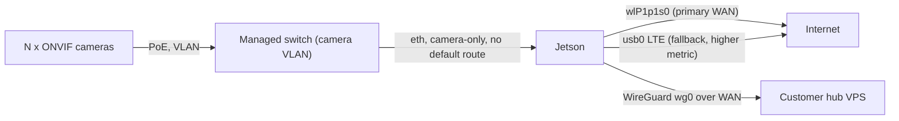

# Kallon Sentry Tower — Living Work Plan (`field-test`)

**Terra Industries · Internal Engineering · branch `field-test`**

This is the **living task board** for the productization effort. It tracks the concrete
deliverables on the `field-test` branch and maps each one back to the canonical plans:

| Source of truth                                   | Role                                                                  |
| ------------------------------------------------- | --------------------------------------------------------------------- |
| `**../../docs/README.md`**                        | **Documentation index — start here**                                  |
| `**../../docs/project-official-reference.md`**    | Canonical technical reference                                         |
| `**../../docs/architecture-setup-guide.md**`      | Layered setup walkthrough                                             |
| `**../../docs/field-test-setup.md**`              | **End-to-end setup & test walkthrough**                               |
| `**../../docs/postgres-windows-server-setup.md`** | **Path P** — Windows Server control plane (Postgres + API + peer-add) |
| `sovereign-stack-brief.md` (v2.0)                 | Why / product intent / exit criteria                                  |
| `mass-deployment-roadmap.md` (v2.1)               | How we build & ship; §11 deliverables checklist; Appendix A           |
| `legacy/bench-snapshot-2025-05.md`                | May 2025 bench snapshot (archived)                                    |

> Build order follows roadmap **Phases 1–4**. The Terra dashboard is a **separate workstream**:
> here we only guarantee its two inlets — **RTSP (video)** and the **signed HTTP webhook (alerts)**.

---

## Guardrails

- All new work lands on branch `**field-test`**.
- Integration surface is **RTSP + signed webhook only**. No dashboard build.
- WAN model: **Wi-Fi primary, LTE fallback**; single Ethernet port reserved for the camera VLAN.
- Idempotent, modular, correctness-first (solo engineer pace, no hard deadline).
- Secrets never committed: `*.example` templates only; real keys live on-device / in vault.

---

## WAN model (target)

- `wlP1p1s0` = primary WAN (lower route metric); `usb0`/`wwan0` = LTE fallback (higher metric).
- `enP8p1s0` = camera VLAN only, **never** a default route — enforced by `30-network-policy.sh`.

---

## Task board

Status legend: `[ ]` todo · `[~]` in progress · `[x]` done · `[H]` hardware-gated.

### Workstream 0 — Branch + doc reconciliation

- [x] Create `field-test` branch from `main`, carry over in-progress doc edits
- [x] Reconcile WAN to Wi-Fi-primary / LTE-fallback (roadmap §2 diagram, §7, Phase 5; brief §4.1/4.4)
- [x] Author this living board (`work-plan.md`)

### Workstream A — Jetson installer  → roadmap Phase 1 / §11

- [x] `deploy/device.env.example` (`WAN_MODE`, `WAN_IFACE`, `WAN_FALLBACK_IFACE`, `CAMERA_IFACE`, `CAMERA_IPS`, watchdog vars)
- [x] `deploy/wg0.conf.example`
- [x] `deploy/iptables-rebroadcast.rules.example` (:8554 on `lo` + `wg0` only)
- [x] `scripts/install/00-preflight.sh`
- [x] `scripts/install/10-packages.sh`
- [x] `scripts/install/20-users-groups.sh`
- [x] `scripts/install/30-network-policy.sh` (WAN metrics, camera-only eth, route assertions)
- [x] `scripts/install/40-wireguard.sh`
- [x] `scripts/install/50-mediamtx.sh`
- [x] `scripts/install/60-camera-route.sh` (generalized from `deploy/kallon-camera-route.service.example`)
- [x] `scripts/install/70-app.sh`
- [x] `scripts/install/80-watchdogs.sh`
- [x] `scripts/install/90-firewall.sh`
- [x] `scripts/install/99-acceptance.sh`
- [x] `scripts/kallon-jetson-install.sh` (orchestrator: `--env`, `--only-module`, `--skip-module`)
- [x] `scripts/kallon-wg-provision.sh` (keygen + render wg0.conf; `--regenerate-keys` to rotate)
- [x] `scripts/kallon-acceptance.sh`
- [x] Verified: `bash -n` on all modules + render smoke tests (wg0.conf / camera-route / mediamtx)

- [H] **Exit:** run on a wiped Jetson → `kallon-acceptance.sh` green *(hardware-gated)*

### Workstream B — Registry + enrollment API  → roadmap Phase 2 / §11

- [x] `registry/migrations/001_initial.sql` (customers, towers, ip_allocations, audit_events)
- [x] `registry/interface.py` (`RegistryProvider`) + `registry/identity.py`
- [x] `registry/postgres_provider.py` (production)
- [x] `registry/sqlite_provider.py` (unit tests only)
- [x] `registry/cli.py` (`create-customer`, `register-tower`, `allocate-ip`, `get-config`, `set-hub`, `list-`*)
- [x] `infra/enrollment-api/app/main.py` (FastAPI `POST /v1/enroll`, `POST /v1/enroll/confirm`; token+HMAC; TLS via proxy) + `peering.py`
- [x] `infra/enrollment-api/requirements.txt` + Caddy/systemd deploy examples
- [x] `scripts/kallon-enroll.sh` (Jetson; auto-enroll + claim code; retry/backoff)
- [x] `deploy/kallon-enroll.service.example` (one-shot; guarded by `/etc/kallon/.enrolled`)
- [x] `../docs/identity-and-secrets.md`
- [x] Verified: `tests/test_registry.py` (10/10), `tests/test_enrollment_api.py` (two towers enroll→confirm→active)
- [ ] **Exit on prod (Path P):** Windows Server live — Postgres + enrollment API + `subprocess` peer-add + TLS *(see `../docs/postgres-windows-server-setup.md` §12)*

### Workstream C — Hub provisioner + integration contract  → roadmap Phase 3 / §11

- [x] `infra/hub-provisioner/interface.py` (`HubProvider` + shared `run_gateway_init`)
- [x] `infra/hub-provisioner/lightsail.py` (default Option B adapter)
- [x] `infra/hub-provisioner/manual.py` (Option C)
- [x] `infra/hub-provisioner/cli.py` → `kallon-hub-provision`
- [x] `scripts/kallon-gateway-init.sh` (WG hub, UFW + wg0 peer forwarding, alert listener systemd) + `infra/hub/alert_listener.py`
- [x] `scripts/kallon-gateway-ensure-forwarding.sh` (hub-only; legacy hub migration)
- [x] `scripts/kallon-gateway-add-peer.sh` (idempotent) + canonical `infra/hub/wg_peers.py`
- [x] Hub runbook in `../docs/postgres-windows-server-setup.md` §8 (Option B + C)
- [x] `../docs/alert-webhook.md` (**integration contract**: alert JSON + `X-Kallon-Signature` HMAC sample + RTSP URL pattern)
- [x] Verified: `kallon-hub-provision --dry-run` wiring, `tests/test_alert_hmac.py`, `tests/test_e2e_two_tower.py` (2 peers, idempotent, key-rotation safe)

- [H] **Exit:** live `kallon-hub-provision cust_lab` on a real VPS → RTSP over VPN *(hardware/network-gated)*

### Workstream D — Pilot sign-off  → roadmap Phase 4 *(hardware-gated)*

Tooling is delivered and ready to run; execution needs physical hardware.

- [H] Managed PoE switch + camera VLAN + ACL
- [H] 24h zero-egress Wireshark capture (once on pilot build)
- [H] Apply + test Jetson iptables (`scripts/install/90-firewall.sh`); confirm SSH survives over Wi-Fi WAN
- [H] PTZ 1,000-command benchmark → `python3 scripts/kallon-ptz-benchmark.py --count 1000`; document or re-baseline sub-100 ms target
- [H] Verify RTSP + webhook against a stub consumer (`scripts/kallon-acceptance.sh` + a dashboard stand-in)

Ready-to-run scaffolding for this workstream:

- `scripts/kallon-acceptance.sh` — routing/WG/RTSP/HMAC checks (run on the Jetson)
- `scripts/install/30-network-policy.sh` — boot-time route assertions (Wi-Fi WAN, camera-only eth)
- `scripts/kallon-ptz-benchmark.py` — p50/p95/p99 latency over N PTZ commands

---

## Explicitly deferred (not in this plan)

- Terra dashboard UI/backend (only RTSP + webhook inlets guaranteed)
- Historical video / playback / DVR
- Golden image; multi-provider hub adapters beyond Lightsail; ArtemisOS; OTA; gRPC sensor bus
(roadmap Phases 6–8)

## Sequencing notes (solo)

- Workstream 0 first (fast, unblocks everything). **Done.**
- A and B interleave; B's enrollment depends on A's `kallon-wg-provision` output shape.
- C depends on B (registry + enrollment) for automated peer add.
- D is hardware-gated (switch, then LTE modem) and runs last.

**Production from day 1 (Path P):** Path A tests → `../docs/postgres-windows-server-setup.md`
on Windows Server → first hub = existing Lightsail as `cust_lab` (same ops SSH key,
Postgres, automated peer-add for all future hubs) → `field-test-setup.md` §5 Jetson.
Path B is offline dev only — not validation.

---

*Living document — update checkboxes as work lands. Canonical deliverable list: roadmap §11.*